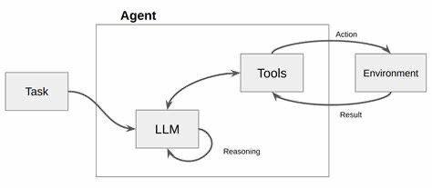

# lc-react-tools: Simple react based tool execution

Prep:
```
python -m pip install -r requirements.txt
```

Commands:

```
python -m streamlit run app.py --server.port=8000
```

## Objective:

The objective is to learn how to solve complex problems using a single agent patterns by iterating over mulitple tools in an interactive user scenario.



## Tasks:

- Add more tools to the code and tune the prompt so that the model can use multiple tools in a chain of input/ outputs
- Implement the following functions (even if they implement static output):
  def get_current_location(username: str) -> str:
  get_current_username(input: str) -> str:
