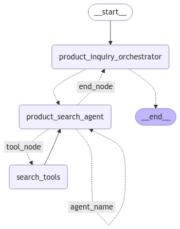
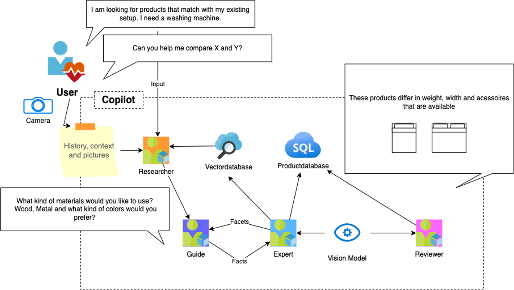

# lg-agents-02-shop: Human in the loop

Prep:
```
python -m pip install -r requirements.txt
```

Commands:

```
python -m streamlit run app.py --server.port=8000
```

## Objective:

The objective is to learn how to solve complex problems using a human in the loop pattern where the agents are asking for human input.



Functional architecture:



## Tasks:

- Add specific questions that the bot should always ask (size, type of material)
- Trace the execution of the bot via open telemetry
