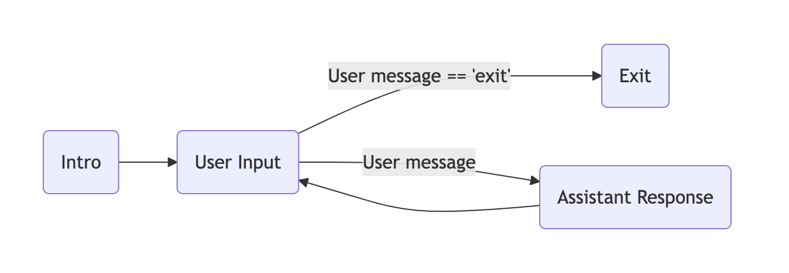

# sk-agents-01-collaboration: Simple multi agent discussion

Prep:
```
python -m pip install -r requirements.txt
```

Commands:

```
python app.py
```

## Objective:

The objective is to learn how to set up agent to agent discussion



External reference: https://learn.microsoft.com/en-us/semantic-kernel/frameworks/agent/agent-chat?pivots=programming-language-csharp

## Tasks:

